# **DIGITAL SYSTEMS DESIGN**


## [Source](https://youtube.com/playlist?list=PLyqSpQzTE6M_dZdF7Bd-UncI5_L_1VkXF&si=N2rjf6XOZxNDVfHP)


-------------------------------------------------

### Design of Digital Systems  :

1.       Digital Representation of Information

2.       Gates & Boolean Algebra, Optimizations

3.       Combinational Logic

4.       Sequential Logic

5.       System Design

6.       FPGA, System, Technological Aspects

Hardware Description Language (Verilog) --> Simulation & Hypothesis --> FPGA Implementation

Analog --> Physical signals with variable range of states

Digital --> Binary signals with only HIGH(1) and LOW(0) states

Number Systems are based on radix (2,8,10,16,etc).

Binary System --> Radix = 2 --> Numbers represented only by 0,1 and in powers of 2

### Rules for Binary Arithmetic :

Binary Addition : 1+1 = (10) 1+1+1 = (11) 1+0 = (1)

Binary Subtraction : 1-1 = (0) 0-1= 1 (1 Borrow)

Negative Number Representation : Signed Bit as MSB : 1 (Negative) or 0 (Positive)

#### Types of Code :

1. BCD (Dividing Binary into groups of 4)
2. Excess 3 BCD (BCD +- 3)
3. Gray Code (XOR current bit and next bit)

### Floating Numbers  : 

#### Fixed Point :

- Agreement between writer and reader
- Number of decimal places does not change
- Total number of digits remain same

Drawbacks :

- Limited Range as number of bits for decimal point increases
- Limited precision


#### Exponential Binary Numbers :

$$
1.101010 \times 2^-7
$$

1 = Significand (Can be +/-)
.101010 = Fraction/Mantissa
-7 = Exponent (Can be +/-)

Typical Binary Representation :

1 bit --> Sign of Significand
Few Bits --> Exponent
Rest of the bits --> Mantissa

IEEE 754 Floating Point :

Standardized Floating Point Number Representation :

64 Bit Number (Double Precision) :

1 bit --> Sign (s)
11 Bits --> Exponent  (Bias of 1023,0,1024 reserved) (e)
52 Bits --> Mantissa (m)

16 Bit Number (Half Precision) :

1 bit --> Sign (s)
5 Bits --> Exponent  (Bias of 15 reserved) (e)
10 Bits --> Mantissa (m)

Extended Precision Representation :

More precise than double precision but Non-standardized.

Intel 80 Bit Number :

1 bit --> Sign (s)
15 Bits --> Exponent (e)
64 Bits --> Mantissa (m)

Example : 

32 Bit Number (Single Precision) :

1 bit --> Sign (s)
8 Bits --> Exponent  (Bias of 127,0,255 reserved) (e)
23 Bits --> Mantissa (m)

Number = $(-1)s \times (1 + 0.m) \times 2^e$


Range of such representation :

$[-1.1 \times 10^-38 , -3.4 \times 10^-38 ]$ or $[1.1 \times 10^-38 , 3.4 \times 10^-38 ]$

Discontinuity at and near 0 and two values of 0

If number is smaller than smallest positive --> positive 0 (0x0000 0000)
If number is smaller than smallest negative--> negative 0 (0x8000 0000)
If number is more than largest positive --> positive infinity

Reserve Exponent Values :

| E   | Mantissa | Number   |
| --- | -------- | -------- |
| 255 | = 0      | Infinity |
|     | != 0     | NaN      |
| 0   | =0       | 0        |
|     | !=0      | Denormal |

De-normal Numbers  :

- Numbers smaller than smallest number and larger than 0
- Exponent is 0
- N = (-1)^s x P x 2^-126 (P = 0 + M ; 0 < M <  1)
- Smallest Denormal Number = 2^-149

#### Addition/Subtraction of Floating Point :

1. Align exponent of smaller number to exponent of larger number
2. Add/subtract the significands
3. Normalize overflow/underflow checks
4. Round
5. If normalized, done. If not, go to Step 3.

#### Multiplication of Floating Point :

1. Add exponents and subtract bias
2. Multiply the significands
3. Normalize overflow/underflow checks
4. Round
5. If normalized, set sign bit and then done. If not, go to Step 3.

Rounding :

| Rounding mode      | Condition for incrementing significand |                                 |
| ------------------ | -------------------------------------- | ------------------------------- |
|                    | +ve number                             | -ve number                      |
| Truncate           |                                        |                                 |
| Round to +infinity | R>0                                    |                                 |
| Round to -infinity |                                        | R>0                             |
| Round to nearest   | R>0.5 \| (R = 0.5 & LSB(M) = 1)        | R>0.5 \| (R = 0.5 & LSB(M) = 1) |


### Boolean Algebra :

Boolean Variables : True/HIGH/1 and False/LOW/0

Basic Gates : AND, OR, NOT
Other Gates : NAND,NOR. XOR, XNOR

#### Truth Tables :

AND :

| A   | B   | Y = A.B |
| --- | --- | ------- |
| 0   | 0   | 0       |
| 1   | 0   | 0       |
| 0   | 1   | 0       |
| 1   | 1   | 1       |

OR :

| A   | B   | Y = A + B |
| --- | --- | --------- |
| 0   | 0   | 0         |
| 1   | 0   | 1         |
| 0   | 1   | 1         |
| 1   | 1   | 1         |

NOT :


| A   | Y = ~A |
| --- | ------ |
| 1   | 0      |
| 0   | 1      |

XOR :

| A   | B   | Y = A  ^ B |
| --- | --- | ---------- |
| 0   | 0   | 0          |
| 1   | 0   | 1          |
| 0   | 1   | 1          |
| 1   | 1   | 0          |

NAND = ~AND & NOR = ~OR

De-Morgan's Theorems :

- ~A.~B = ~(A + B)
- ~A + ~B = ~(A.B)

#### Basic Theorems :

- X + 0 = X     X + 1 = 1
- X.1 = X         X.0 = 0
- X+X = X      X.X = X
- ~(~X) = X    X + ~X = 1    X.~X = 0

#### Simplification Theorems :

Uniting : XY + X.~Y = X                 ( X+Y)(X+~Y) = X

Absorption :  X+X.Y = X                  X(X+Y) = X

Elimination :  X + ~X.Y = X+Y         X(~X+Y) = X.Y

Consensus :      XY + ~X.Z + YZ = XY + ~X.Z                              (X+Y)(~X+Z)(Y+Z) = (X+Y)(~X+Z)


Boolean Expressions :

- SOP (Sum Of Products) :  Literals --> AND/Product ; Terms --> OR/Sum

  Ex : A.B + C.D + ~A.C

  Method to Obtain SOP from Neither SOP/POS Expression : Multiplying out

- POS (Product Of Sums) :  Literals --> OR/Sum ; Terms --> AND/Products

  Ex : (A+B)(C+D)(~A+C)

  Method to Obtain POS from Neither SOP/POS Expression : Factoring

#### Canonical/Standard Form :

Canonical SOP : 

1. Each term should contain all variable in either normal or compliment forms
2. If number of input parameters is N, number of literals in each term is N.
3. Each product term is minterm.
4. It represents one row of truth table of expression where output is 1.

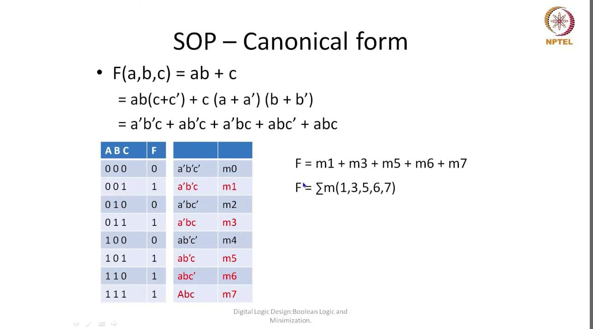

Canonical POS : 

5. Each term should contain all variable in either normal or compliment forms
6. If number of input parameters is N, number of literals in each term is N.
7. Each sum term is maxterm.
8. It represents one row of truth table of expression where output is 0.

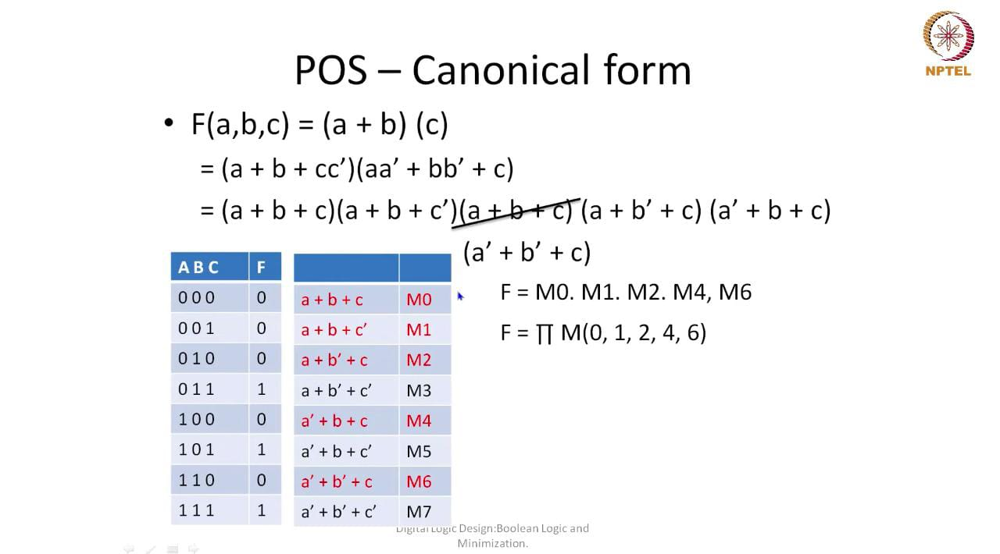


Canonical SOP and POS forms are complementary.

#### Boolean Simplification using Karnaugh Maps :

- Offers a visual solution
- Arrange minterms/maxterms in 2D/3D Map where each cell is a minterm/maxterm
- Adjacent Cells have only one variable/ one bit difference.
- Use of gray code

Rules :

- Put 1/0 for each minterm/maxterm as per the expression (variable = 1/~variable = 0 for SOP and variable=0/~variable=1 for POS)
- Groups of such bits can only be made for consecutive terms (NOT DIAGONAL) or first and last terms of a row/column or a square.
- MSB variable (a) along the row and LSB/Rest variables (bc) along the column
- For simplified expression of a group, variable changing in value is optimized by removing it from the expression
- For SOP --> Literals --> AND and For POS --> Literals --> OR
- Don't Care bits are represented by X and are only used when such a combination yields a better expression

Examples :

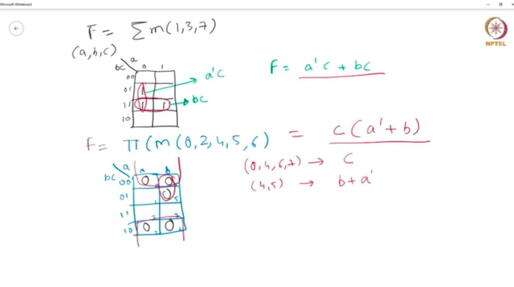

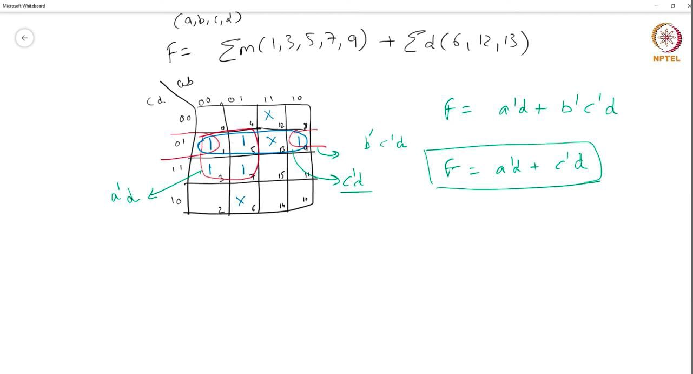


### Karnaugh Maps :

Rules  :

- If transposed, numbering starts from 0 and continues along the row. However, this does not affect the result.

- Implicant : Subset of SOP expression

- Prime Implicant : Implicant that cannot be further optimized/converted into a larger set/cube

- Essential Prime Implicant : Minterm that is part of only one singular prime implicant

Process :

1. Find prime implicants
2. Find essential prime implicants
3. Exclude any repeated sets
4. Check if all minterms are covered
5. If not, find most optimized solution for remaining minterm
6. If yes, represent in minimum SOP expression


Building a K-Map for 5 Variables :

- Method 1 : Build a normal 4x4 K-Map using variables other than MSB. Divide each cell into upper and lower triangular sections where MSB = 1 for upper triangular section and MSB = 0 for lower triangular section. Adjacent only possible for same triangular sections.

- Method 2 : Build two 4x4 K-Maps using variables other than MSB - one for MSB = 1 and another for MSB = 0.

- Method 3 : Build a 8x4 K-Map of abc vs de (first 3 variables including MSB vs last two variables).

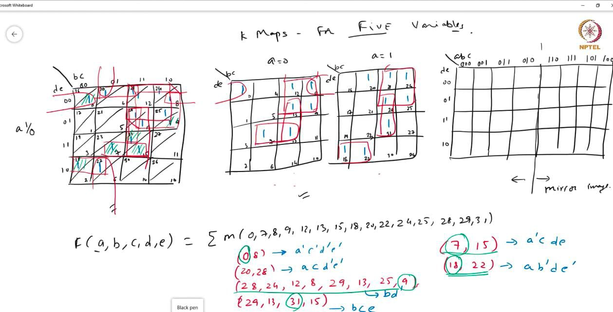

K-Maps get more complex with more number of variables and cannot be automated.

### Quine-McCluskey / QM Method :

Procedure :

- Find all the prime implicants
- Find essential prime implicants
- Find minimum number of prime implicants required to cover all the minterms

Basic Principle of Minimization = X.Y + X.~Y = X

1. Finding Prime Implicants Phase :

- Compare every pair of minterms :

- Combine a pair if only one variable differ
- Reduce comparison by grouping
- Remove redundant pair, if any

- Repeat the process for the new stage till no more stage can be created

1. Covering Phase

Process :

- Stage 1 : Group minterms

- Stage 2 : Group implicants in pairs group-wise as is in Stage 1

- Stage 3 : Group implicants into cubes group-wise as is in Stage 2

Verification : 

- Verify if Stage 2 implicants are present in Stage 3 cubes and remove any redundant terms

- Verify all minterms are present as implicant pairs in Stage 2

Minimization :

- Create a prime implicant chart
- For every prime implicant, note down minterms involved
- Prime implicants that have minterms that are involved only once across all prime implicants are Essential Prime Implicants and must be included in expression
- Check for remaining minterms not covered in cubes/essential prime implicants
- Get most optimized implicant involving these remaining minterms


Example :

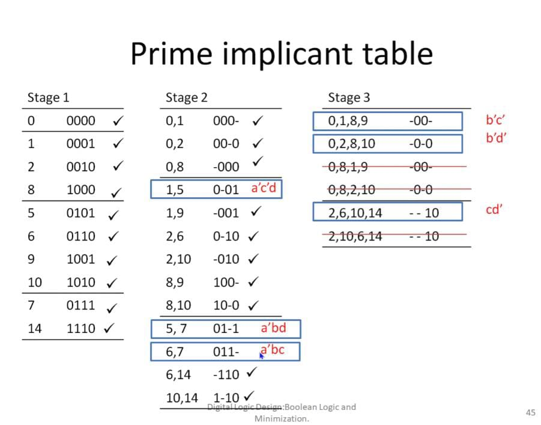

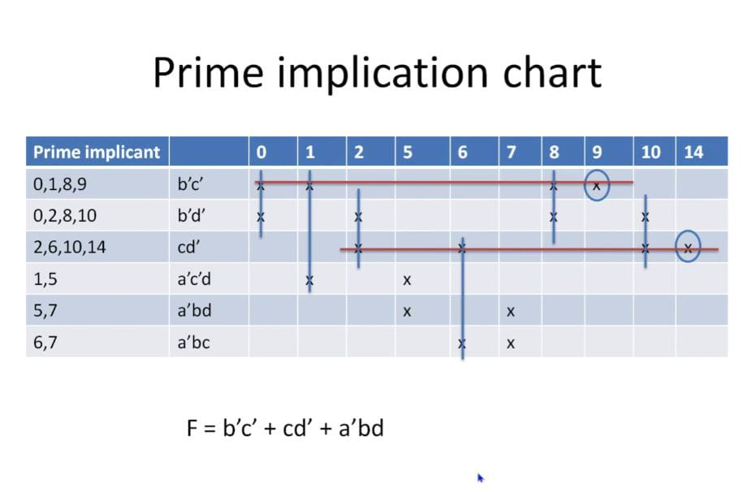


Cyclic Dependencies :

For repeated/cyclic implicant grouping, choose one random group and solve the remaining groups accordingly.

Example : 

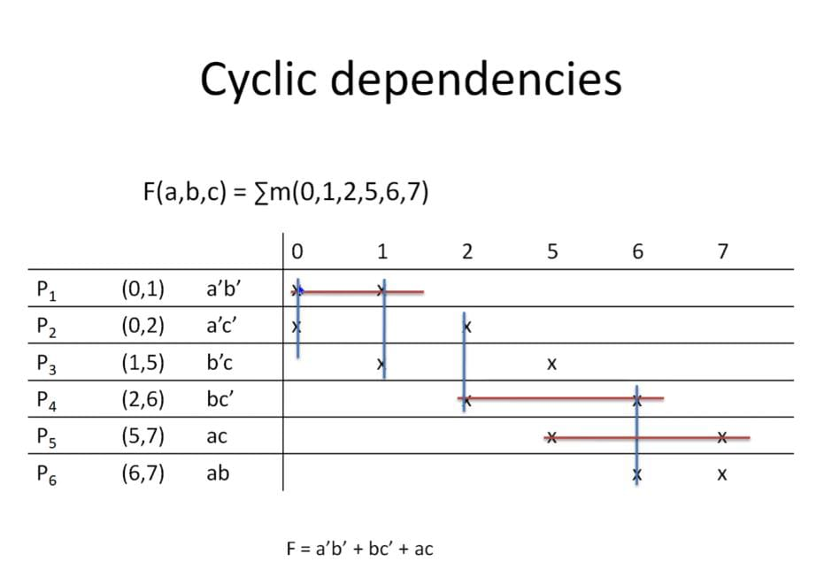


Incompletely Specified Solution :

- Don't care terms are treated like regular terms while finding prime implicants

- Don't care terms are NOT included in prime implication chart i.e. no contribution to essential prime implicants.

Example :

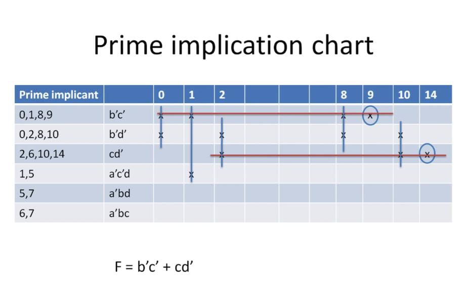


### Area Delay Model :

- Logic Optimization :

- Input : Boolean Expression

- Output : Optimal Two Level Logic (SOP/POS)

- Optimality Criteria :
- Minimum number of product/sum terms
- Minimum number of literals in each product/sum term

#### Area and Delay :

Area depends on number of inputs.

Delay :

- Input/Fan-In
- Output/ Fan-Out
- T_p = Propagation Delay

- $$
T_p = a_1F_{in} + a_2F^2_{in} + a_2F_{out}
$$
- Delay is directly proportional to square of input and linearly with output.

- Transistor size is usually modified for large fan-in gates

Delay of Gate depends on :

- Type of Gate
- Input transition type (0 --> 1 or 1 --> 0)
- Output transition type
- Fan-in and Fan-out

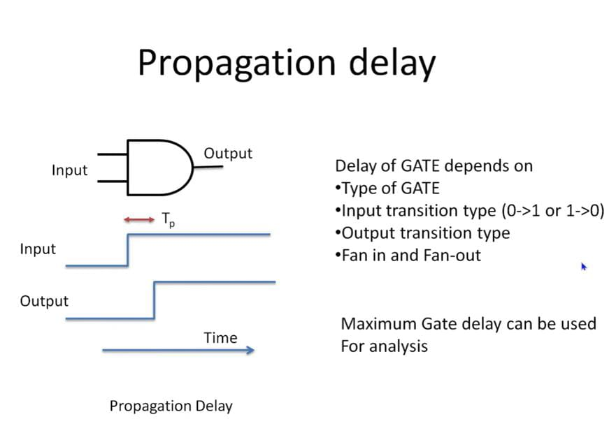

Points :

Maximum gate delay used for analysis

Total Delay is sum of maximum delays for constituent stages.

Variation in delay causes glitches at output

Variation in input before delay causes confusion in output (whether current output is correspondent to current or previous input) and thus is not ideal

Example :

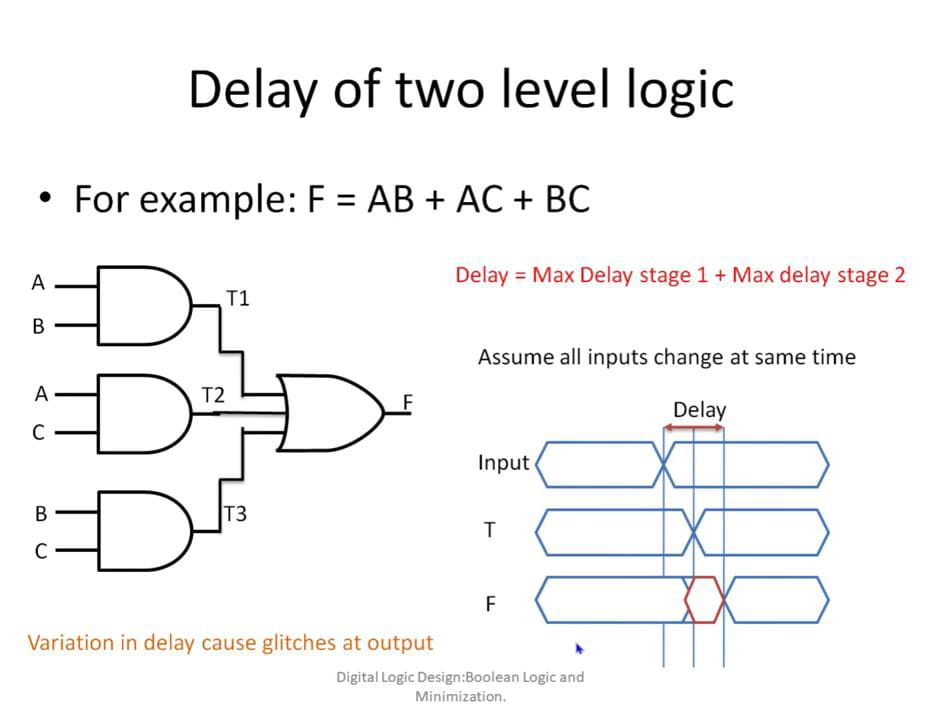

Impact of large fan-in :

Larger number of inputs in a single input causes larger propagation delay.

Therefore, it is better to convert single-level gates to multi-level combination of gates to minimize delays.

Number of stages required to break up single-level multiple-input gate into several 2-input gates (n = number of inputs) : $log_2 n$


### Multi-Level Logic :

Delay in multiple level logic depends on longest path from input to output called the critical path.

Modelling delays in Verilog :

```
and #7 a1(out, i1, i2); //Fixed delay of 7

and #(3,7) a2(out, i1,i2) //Rise delay/time (0 --> 1), Fall delay/time (1 --> 0)

and #(3,7,9) a3(out,i1,i2) //Rise time, Fall time, Switch off time (High impedance state --> 1/0)
```

No # --> No/0 delay

Dataflow Modelling : 

```
assign #7 out = in1 & in2; //Output changes (due to input changes) after 7 time units after input changes

wire #7 out; //Value assigned after 7 time units
```

Input should not change before propagation delay.  

### Multiplexer :

#### Multiplexer/MUX :

Multiplexer (MUX) converts multiple inputs into a single output.

Example :
A,B --> Input Z --> Output :

- Output = A if A is selected
- Output = B if B is selected

A & B Selection --> Through 1-Bit Control :

- Control = 0 --> A is selected
- Control = 1 --> B is selected

- Z = A.~Control + B.Control

For 4-Input A,B,C,D : consider two control bits c0 c1 :

- c0c1 = 00 --> A
- c0c1 = 01 --> B
- c0c1 = 10 --> C
- c0c1 = 11 --> D

- Z = A.~c0~c1 + B.~c0c1 + C.c0~c1 + D.c0c1

Thus for a N-to-1 Multiplexer with N inputs, Number of bits in Control C = $ceil(log_2N)$

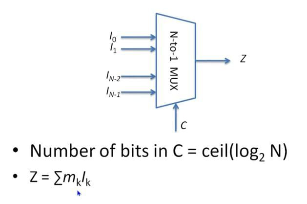


#### Multi-Bit Multiplexer :
Consists of multiplexers for each bit of output. In representation, a / along with number of bits to indicate size of the input/output bus.

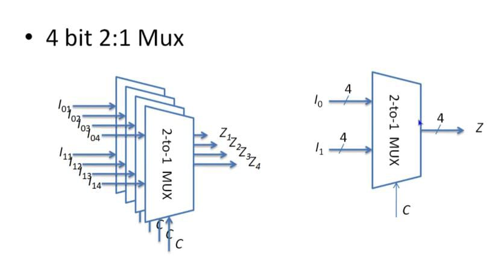


#### Applications of MUX :

- Designing any generic circuits such as AND gates (output table of such circuit being multiplexer input and input of circuit being control bits)
- Emulating if-else/switch conditional logic on hardware level
- Used whenever selection of one input out of multiple inputs is required

#### Four-State Logic :

Four States :

- HIGH / 1
- LOW / 0
- UNKNOWN / X
- HIGH-IMPENDANCE / Z


#### Four State Logic Simulation :

AND : 

| AND   | 0   | 1   | X   | Z   |
| ----- | --- | --- | --- | --- |
| **0** | 0   | 0   | 0   | 0   |
| **1** | 0   | 1   | X   | X   |
| **X** | 0   | X   | X   | X   |
| **Z** | 0   | X   | X   | X   |

OR : 

| OR    | 0   | 1   | X   | Z   |
| ----- | --- | --- | --- | --- |
| **0** | 0   | 1   | X   | X   |
| **1** | 1   | 1   | 1   | 1   |
| **X** | X   | 1   | X   | X   |
| **Z** | X   | 1   | X   | X   |

- Simulations : X --> Wrong connections/Missing Inputs/ Incorrect Design

- Actual Gates : X --> Uncertain (Could be 0 or 1)
  Faulty IC/Gates or Wrong Inputs/Connections

#### Tri-State Buffer :

Buffer is used to strengthen signal and increase driving capability (when output is driving multiple inputs --> strength/driving capability needs to be higher)

Buffer :

| A   | Y   |
| --- | --- |
| 1   | 1   |
| 0   | 0   |

Tri-State Buffer uses a third floating high-impedance state Z by using another input B. When B = 1, it acts as a normal buffer but when B=0, then it switches to Z. If B is inverted, then the opposite happens. :


| A   | B   | Y   |     | A   | B   | Y   |
| --- | --- | --- | --- | --- | --- | --- |
| 0   | 1   | 0   |     | 0   | 0   | 0   |
| 1   | 1   | 1   |     | 1   | 0   | 1   |
| 0   | 0   | Z   |     | 0   | 1   | Z   |
| 1   | 0   | Z   |     | 1   | 1   | Z   |

MUX Implementation :

Two tri-state buffers can be used to implement a MUX. One input is inverted tri-state buffer while the other is normal. Control acts as the B/Buffer input. It is used where multiple sources driving a signal ensuring the appropriate input is driving the signal while others simultaneously remain unconnected/in high-impedance state.

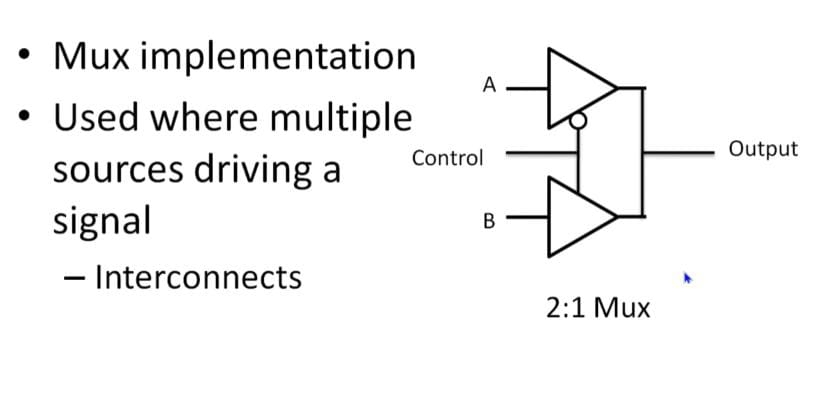

Since Z is usually used to notice errors and considered an invalid output/input, by making Z a valid input/output, it becomes difficult to verify errors in a design. Thus, tri-state buffers are not commonly utilized.

### Demultiplexers:

Demultiplexer(DEMUX) is a circuit that converts a single input into an output from multiple outputs depending on control bits. 

Thus for a 1-to-N Demultiplexer with N outputs, Number of lines in Control C = $ceil(log_2N)$

### Decoders :

Decoders is a circuit similar to DEMUX that converts a set of inputs into output depending on the input pattern (similar to how DEMUX output is chosen based on input Control line pattern) i.e. converts an encoded signal back to its original form.  

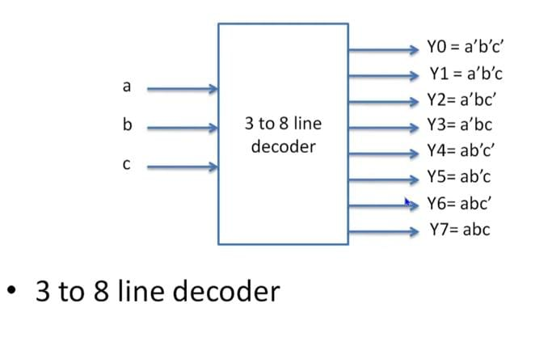

Thus for a M-to-N Decoder with N outputs, Number of lines in Input M = $ceil(log_2N)$
  
Hierarchical Decoders : A complex or larger decoder can be broken into smaller decoders.

Example :

A 3 to 8 line decoder can be broken by 2 methods :

- Using two 2 to 4 line decoders with ~a and a acting as enable signals (outputs Y0-Y3 for upper decoder and Y4-Y7 for lower decoder)


- Using a 2 to 1 decoder to split up a to two 2 to 4 decoders.

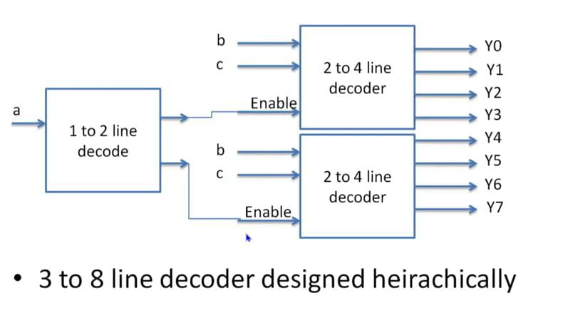


Example : 


Decoders can also be used to design generic circuits (in SOP (normal output)/POS form(inverted output))

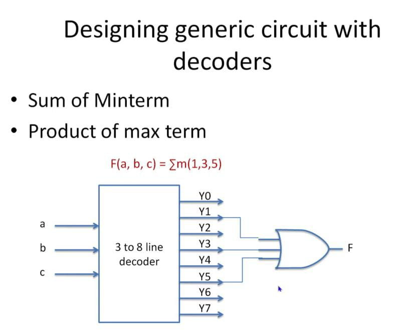

### Encoders :

Encoder is a circuit that converts a standard input into coded output depending upon the state of inputs.

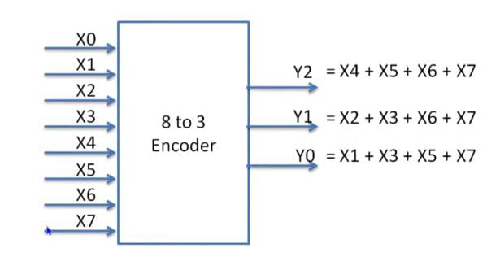

- $2^N$ inputs and $N$ outputs.
- Assume only one of the inputs is high, output encodes the input number.
- Used in Interrupt System

#### Priority Encoding :

Priority encoding is used to resolve situations where more than one input is high by setting a priority order and solving the output.

Example :

Here, X7 has highest priority and X0 has lowest priority. For any input to be converted to output, any other input lesser in priority than it are X (don't care) while any other input higher in priority has to be 0.

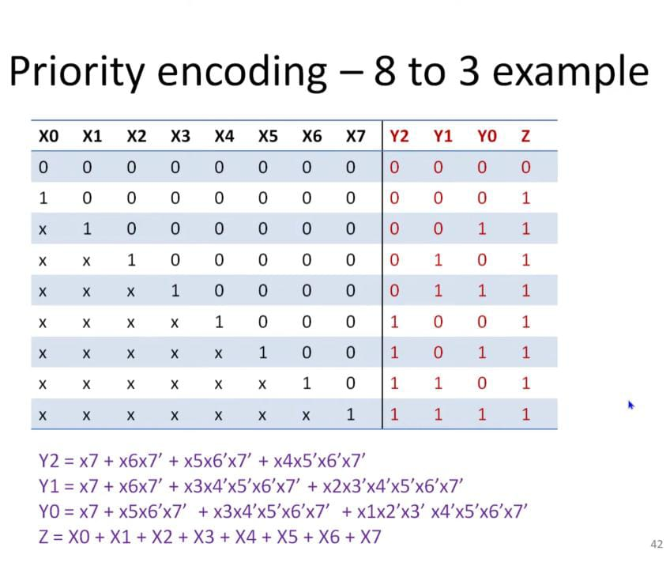

Encoders are commonly used to convert display decimal values 0-9 in a Seven-Segment Display with binary/BCD input and display output.

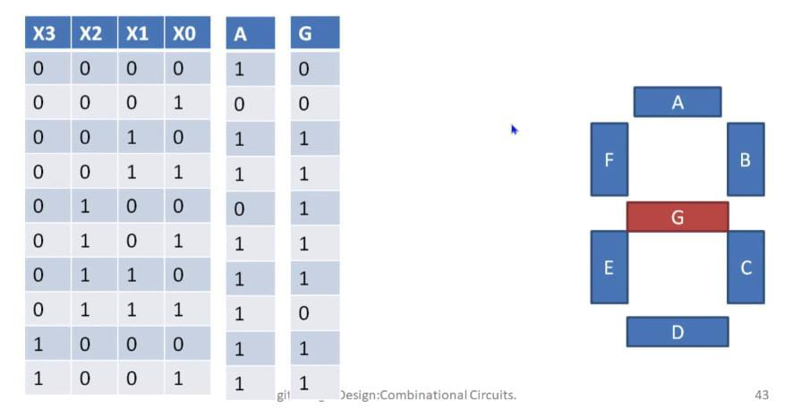

### Programmable Hardware :

2^(2^N)possible distinct functions for N variables.


#### ROM (Read Only Memory) :

A type of memory from which data can only be read from but not written into.

- Input : Address
- Output : Bits stored at input address (Word)
- Memory Size : For a $N$-bit address and word size of $M$-bit, then size of memory is $2^N \times M$ bits.

- To design a combinational circuit with $N$ variables and $M$ output : ROM Size :  $2^N \times M$

- To design a ROM of size $N \times M$ : $M$ functions with $ceil(log_2N)$ variables

#### Programmable Logic Devices (PLD) :

Programmable Logic Array (PLA) :

Complex Programmable Logic Devices (CPLD) :

- Multiple Function Blocks where each is AND-OR PLA

- Uses an Interconnect Array to connect signals from input/output or between function blocks.


Field Programmable Gate Array (FPGA) :

The basic unit is Configurable Logic Block (CLB) using a Lookup Table (LUT).

![[CLA 1.jpeg]]

### Ripple Carry Adder :


#### Single Bit Adder :

Sum : A ^ B ^ C
Carry-Out : AB + AC + BC

A three-input XOR gate is not preferred due to the greater delay. Instead, a two XOR gate structure is used wherein the output of XOR with A and B is fed to the XOR gate with Cin to get sum. Thus, in the second implementation, the delay will be reduced and the output sum will be generated when Cout from previous adder is fed as Cout to current adder.

![[SBA 1.jpeg]]
#### N-Bit Adder :

- Cascading N Single Bit Adders wherein output carry is fed to next adder as input carry.

- Area : N(Two 2-Input XOR Gate + 3 2-input AND + one 3-input OR)

- Delay : (N-1)(2 Level Gate Delay) + max(XOR Delay, AND-OR Delay) = N(2 Level Gate Delay)

![[FBA 1.jpeg]]

### Carry Look Ahead Adder :

  Source of delay is sequential carry generation and propagation.

 Carry Generation : When $A_i$ and $B_i$ are 1
 Carry Propagation : When $A_i$ and $B_i$ is 1
 Carry Kill : When both $A_i$ and $B_i$ is 0

 $G_i = A_iB_i$
 $P_i = A_i + B_i$

A carry out for a particular stage is 1 if either it is generated at that stage or propagated from previous stage.


However, for larger adders. CLA will generate more delay due to an increase in fan-in requiring more area for carry generation block. Therefore, the larger adders are divided into N/4 (for N-bit larger adder) smaller 4-Bit CLA Adders.

Example (For a 16 Bit Adder) :

![[TLCLA 2.jpeg]]

![[TL2 2.jpeg]]

![[LCLA 2.jpeg]]
### Carry Select Adder (Fast Adder) :

A Carry Select Adder is a type of adder  that duplicates the addition - one assuming input carry is 0 and other assuming it to be 1 - but only gives one appropriate output by selecting the correct addition through a multiplexer by using the input carry when it is available.

![[CSA 1.jpeg]]

Unequal Groups :

![[CSAUEG 1.jpeg]]

Equal Groups :

![[CSAEG 1.jpeg]]
### Multiple Operand Adder :

![[MOA1 1.jpeg]]

![[MOA2 1.jpeg]]


## Sequential Circuits :

Sequential circuit is a type of circuit in which output is dependent on both present and past inputs. Essentially, it is a circuit which can "remember" i.e. have a memory, in contrast to earlier combinational circuits whose outputs are dependent only on current inputs. A sequential circuit can be synchronized through a clock signal. 

![[SQC 1.jpeg]]

Building blocks : 

- Latches
- Flip=flops
- Registers
- Counters
- Memory

### Latches :

A latch is a basic asynchronous sequential digital circuit with memory capability of storing 1 bit of information, wherein output changes immediately upon receiving input.

#### Types of Latches : 

##### S-R Latch : 

An S-R (Set-Reset) Latch is type of latch with two inputs - set and reset and two outputs - Q and Q'. When S = 1 (R=0), output Q = 1 (Q' = 0) and the latch is in the 'set' state. When R = 1 (S=0), output Q = 0  (Q' = 1) and the latch is in the 'reset' state. When both S = 0, R =0, the latch retains its previous state i.e. remembering and storing its previous output. However, when both S = 1, R = 1, the output is undefined and the latch is in "forbidden" state.


![[SRL 1.jpeg]]

![[SRLT 1.jpeg]]

##### D Latch : 

An D Latch is type of latch with two inputs - data and enable and two outputs - Q and Q'. When Enable = 1, the latch is considered transparent and changes in input D are reflected in output Q.
When Enable = 0, the latch is considered opaque and it assumes the previous value as output Q which is independent of input D in this state. D-Latches avoid undefined conditions unlike SR Latches.

![[DL 1.jpeg]]

### Flip-flops :

A flip-flop is a basic synchronous sequential digital circuit with memory capability of storing 1 bit of information, wherein output changes dependent upon changes in input only at the edge of synchronizing signal unlike latches where change in output is immediate.

##### D Flip-Flops :

An D Flip-Flop is type of flip-flop with two inputs - data and clock and two outputs - Q and Q'. At the rising or falling edge of clock signal, changes in input D are reflected in output Q. Otherwise,  the previous value is the output Q independent of input D in this state. D Flip-Flops moderates the transmission speed allowing the data to be stored for sufficient time to be used elsewhere unlike Level-Triggered D Latches.

![[DFFC 1.jpeg]]

![[DFF 2.jpeg]]

##### JK Flip-Flops :

An JK Flip-Flop is type of flip-flop with two inputs - J (set) and K (reset) and two outputs - Q and Q'. When J = 1 (K=0),the flip-flop sets and output Q = 1 (Q' = 0). When K = 1 (J=0),the flip-flop resets and output Q = 0  (Q' = 1). When both J = 0, K =0, the flip-flop retains its previous state. When both J = 1, K = 1, the flip-flop toggles or inverts its output. All output changes only appear at the edge of a synchronizing clock signal.

![[JKFFC 1.jpeg]]

![[JKFF 1.jpeg]]


##### Master-Slave Flip-Flops :

A master-slave flip-flop is a synchronized sequential circuit consisting of two flip-flops : master and slave - output of master is given as the input to the slave. The master flip-flop is connected to the clock signal while the slave flip-flop is connected to the inverted flip-flop. When the clock signal is active, the master flip-flop is enabled and samples the input data into its output while the slave flip-flop is disabled. When the clock signal is inactive, the slave flip-flop is enabled and samples the input data (output of master flip-flop) into its output while the master flip-flop is disabled Master-Slave Flip-Flops are stable circuits that prevent undefined/race conditions.

![[MSFF 1.jpeg]]

#### State/Next/Characteristic Equations :

![[ALLFF 1.jpeg]]


### Counters :

